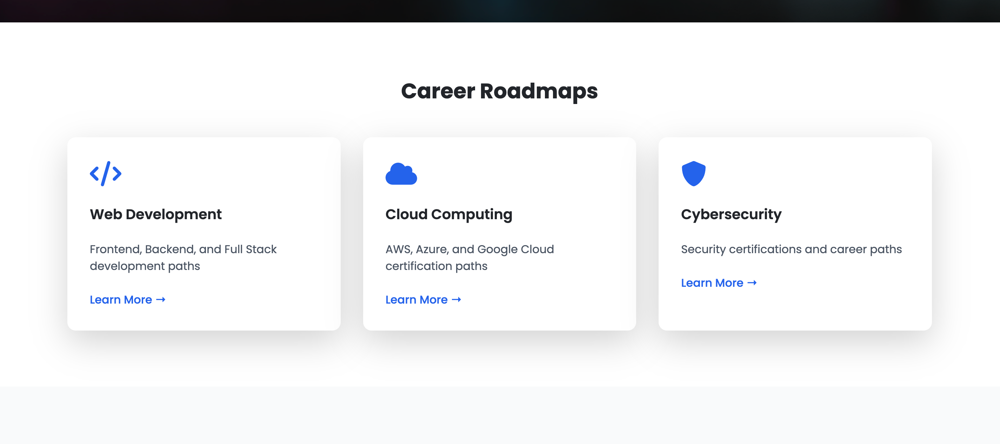

# EducaTI - Your Path to IT Success 🚀

## Overview

EducaTI is a comprehensive educational platform designed to guide aspiring IT professionals through their career journey. The platform offers structured learning paths in three main areas:
- Web Development
- Cloud Computing
- Cybersecurity


## Purpose

EducaTI was developed to address the growing need for structured IT education and career guidance. The platform serves as a bridge between aspiring IT professionals and the industry by:

- Providing clear career roadmaps
- Offering curated learning resources
- Presenting certification paths
- Showing salary expectations and career progression

## Features ✨

### 1. Career Roadmaps
- Detailed learning paths for each specialization
- Step-by-step progression guides
- Time estimates for skill acquisition



### 2. Interactive Learning Paths
- Frontend Development
- Backend Development
- Cloud Computing (AWS, Azure, GCP)
- Cybersecurity and Network Security


### 3. User Management
- Secure user authentication
- Personalized learning tracking
- Progress monitoring

## Technology Stack 🛠️

- **Frontend:**
  - HTML5
  - Tailwind CSS
  - JavaScript
  - Font Awesome Icons

- **Backend:**
  - Python 3.x
  - Flask Framework
  - MySQL Database
  - Werkzeug Security

- **Development Tools:**
  - Git & GitHub
  - Visual Studio Code
  - MySQL Workbench

## Installation & Setup 🔧

1. **Clone the Repository**
   ```bash
   git clone https://github.com/pacheco20222/EducaTI
   cd EducaTI
   ```

2. **Create Virtual Environment**
   ```bash
   python -m venv venv
   source venv/bin/activate  # On Windows: venv\Scripts\activate
   ```

3. **Install Dependencies**
   ```bash
   pip install -r requirements.txt
   ```

4. **Database Setup**
   - Create a MySQL database named 'EducaTI'
   - Run the following SQL script:
   ```sql
   CREATE TABLE users (
       user_id INT AUTO_INCREMENT PRIMARY KEY,
       first_name VARCHAR(100) NOT NULL,
       second_name VARCHAR(100),
       lastname VARCHAR(100) NOT NULL,
       second_lastname VARCHAR(100),
       password_hash VARCHAR(255) NOT NULL,
       email VARCHAR(50) NOT NULL UNIQUE,
       birthdate DATE NOT NULL,
       country VARCHAR(100) NOT NULL,
       created_at TIMESTAMP DEFAULT CURRENT_TIMESTAMP
   );
   ```

5. **Environment Configuration**
   - Copy `.env.example.txt` to `.env`
   - Update the database credentials in `.env`:
   ```env
   DB_HOST=localhost
   DB_USER=your_username
   DB_PASSWORD=your_password
   DB_NAME=EducaTI
   ```

6. **Run the Application**
   ```bash
   python app.py
   ```
   The application will be available at `http://localhost:5000`

## Project Structure 📁

```
EducaTI/
├── static/
│   ├── img/
│   │   ├── image-1.png
│   │   ├── compatiaa+.png
│   │   ├── data.png
│   │   └── security+.png
│   │   └── mayab.png
│   │   └── hero_section.png
│   │   └── learning_path.png
│   │   └── roadmap.png
│   │   └── homepage.png
├── templates/
│   ├── base.html
│   ├── index.html
│   ├── webdev.html
│   ├── cloud.html
│   ├── cyber.html
│   ├── login.html
│   └── signup.html
│   └── 404.html
│   └── 500.html
├── app.py
├── requirements.txt
├── .env
├── .env.example
└── README.md
```

## Usage Guide 📚

1. **Homepage Navigation**
   - Browse different career paths
   - Explore certification options
   - View salary expectations


2. **User Registration**
   - Create an account
   - Complete your profile
   - Access personalized content


3. **Career Path Selection**
   - Choose your desired IT path
   - Follow structured learning guides
   - Track your progress

## Contributing 🤝

This project is part of a university competition and is currently not open for external contributions. However, feedback and suggestions are welcome!

## Future Enhancements 🔮

- Integration with online course platforms
- Progress tracking system
- Interactive learning assessments
- Community forum
- Job board integration
- Mobile application

## Author ✍️

- **Name:** Jose Ricardo Pacheco
- **University:** Anahuac Mayab
- **Program:** Information Technology Engineering

## Acknowledgments 🙏

- Faculty mentors and advisors
- Beta testers and early users
- The IT community for valuable insights

## License 📄

This project is created for educational purposes as part of a university competition. All rights reserved.

---


*This project was developed as part of entrepreneurship class at Anahuac Mayab*